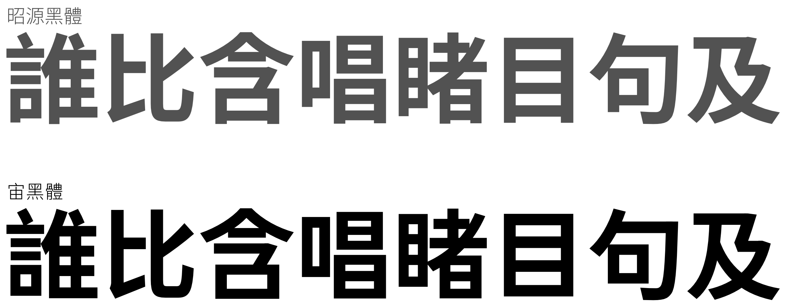

Zev Hei TC 宙黑體
====================

由[昭源黑體](https://github.com/chiron-fonts/chiron-hei-hk/) 改造而成的免費黑體字型，對原有漢字字形進行「拔腳」、「折筆尖角磨平」、「移除喇叭口特徵」處理，提供與昭源黑體稍微不同的字形風格。

注意事項
--------------------
- 安裝後的字體家族名稱是 Zev Hei TC Dev。
- 本字型屬實驗性質。
- 目前字形參數大多承襲自昭源黑體。將來發佈的新版本可能會有較大改動（包括字型名稱），因此不保證向後兼容性。

使用授權
--------------------
本字型採用 [OFL-1.1](https://scripts.sil.org/cms/scripts/page.php?site_id=nrsi&id=OFL) 授權，詳情請參閱[LICENSE.md](LICENSE.md)。

