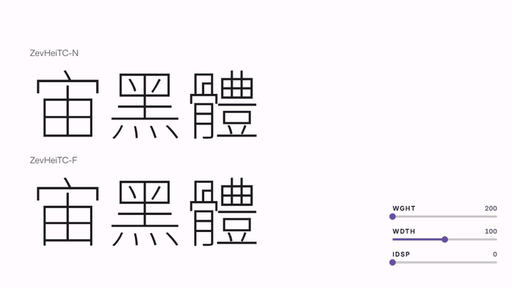

Zev Hei TC 宙黑體
====================

宙黑體是由[昭源黑體](https://github.com/chiron-fonts/chiron-hei-hk/)改造而成的免費黑體字型，提供與昭源黑體不同的字形風格。

比較
--------------------

以下是宙黑體與昭源黑體字形差異的比較：

1. 宙黑體對原昭源黑體漢字字形進行「拔腳」、「折筆尖角磨平」、「移除喇叭口特徵」處理，字形較具幾何感。
2. 宙黑體的英文字形嵌入 [Mona Sans](https://github.com/github/mona-sans/)
   字型，不同於昭源黑體的 [Source Sans](https://github.com/adobe-fonts/source-sans) 英文字形。
3. 受惠於 Mona Sans 提供的窄體和寬體字形，宙黑體也通過 wght 軸提供 80% 至 120% 的字形寬度選項，提供更多的字形風格選擇。
4. 宙黑體並提供 IDSP 軸（Ideographic Spacing 表意字字距調整軸），為漢字提供較寬鬆的字距選擇，本意是用作收窄字寬時的字距補償。
5. 宙黑體對「拔腳」處理提供兩種變體：N 版屬「完全拔腳」，F 版則保留字形底部用作承托用的「腳」的特徵。
6. 宙黑體沒有昭源黑體的 Text 版和與之對應、可變字型的 PADG 軸和斜體。

命名
--------------------

安裝後的字體名稱是 ZevHeiTC-[VARIANT]，其中 [VARIANT] 是 N 或 F，分別代表「完全拔腳」和「保留底腳」兩種字形變體。兩款字體均提供字重、字寬和表意文字字距的變化的調整選項。

字體有為不完全支援可變字型的應用程式定義各種預設靜態項目，命名規則為：

`ZevHeiTC-[變體] Dev [字重] [字寬] [表意文字字距]`

以下是一些例子：

- ZevHeiTC-N Dev
- ZevHeiTC-F Dev 200
- ZevHeiTC-F Dev 300 E20
- ZevHeiTC-F Dev 600 C80 A5

各部份的説明如下：

### 字重 (wght)

字體提供 200 (最幼) 至 900 (最粗) 的字重選項，在靜態項目中會直接用數字表示。以下提供常見字重名稱供參考：

| 字重值 | 常見字重名稱     |
|-----|------------|
| 200 | ExtraLight |
| 300 | Light      |
| 350 | Normal     |
| 400 | Regular    |
| 500 | Medium     |
| 600 | SemiBold   |
| 700 | Bold       |
| 900 | Heavy      |

其中 400 屬預設字重，在個別應用程式會略過字重值，只顯示字體名稱（如 `ZevHeiTC-N Dev`）。而 700 (Bold) 是與 400 (Regular)
連結的粗體字重，部分應用程式須透過「粗體」樣式切換（例如 Word 的「粗體」按鈕）才能使用，不會出現在字體選單中。

### 字形寬度 (wdth)

字體提供 75% 至 125% 的字形寬度選項，預設為 100%。字體定義了以下靜態項目：

| 名稱  | 數值              |
|-----|-----------------|
| C80 | 原字形 80% 寬度      |
| C90 | 原字形 90% 寬度      |
| (空) | 原字形 (即 100% 寬度) |
| E10 | 原字形 110% 寬度     |
| E20 | 原字形 120% 寬度     |

"Cx" 可理解為 "condensed to x%"（收窄至 x%），"Ex" 可理解為 "expanded by x%"（擴展 x%）。

### 表意文字字距 (IDSP)

只針對表意文字（漢字）的字距增幅。提供 0 至 500 的選項。字體中文字圖的字寬為 1000upm，增加 200upm 字距亦即增加 20% 的字距。預設為
0，表示不增加任何字距。

| 名稱  | 數值                      |
|-----|-------------------------|
| (空) | 原字距                     |
| A5  | 增加 5upm 字距 (即 5upm 增距)  |
| A10 | 增加 10upm 字距 (即 5upm 增距) |

靜態項目增加字距的選項只會在伴隨收窄字形（C80、C90）出現。

注意
--------------------

- 宙黑體的 80% 至 120% 字形寬度是原有 100% 的程式調整，不經人手處理，可能會有瑕疵。
- 本字型目前屬測試性質，故字體名稱有 Dev 字樣。「測試性質」表示將來發佈的新版本可能會對字型名稱、式樣命名等基礎成份有較大改動，不保證向後兼容性。

配置
--------------------
字體目前提供以下使用配置：

- 可變字體 (Variable Font)，包括 .otf 和 .ttf 格式。
- 網頁字體 (Web Font)，包括 OpenType outline 和 TrueType outline 的格式。

下載
--------------------
目前未有 Release 發佈，請直接從 GitHub 的 `master` 分支下載字體檔案。

使用授權
--------------------
本字型採用 [OFL-1.1](https://openfontlicense.org/) 授權，詳情請參閱[LICENSE.md](LICENSE.md)。

